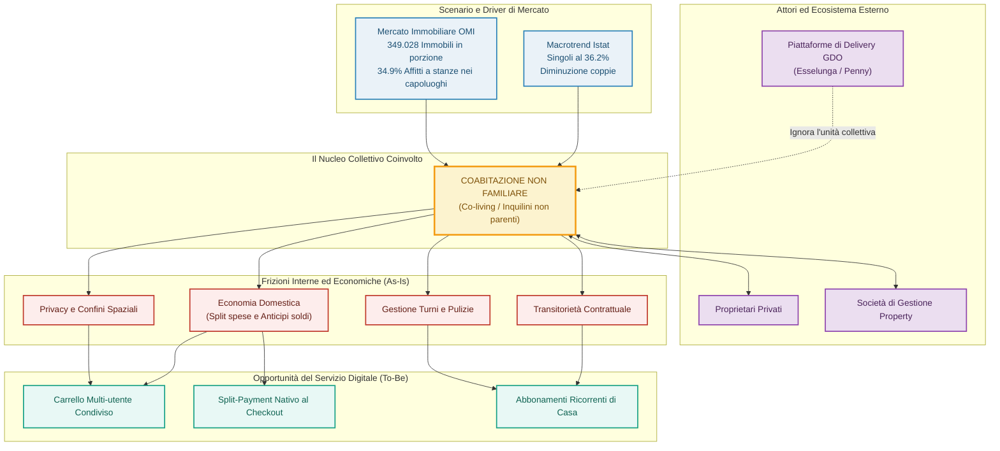
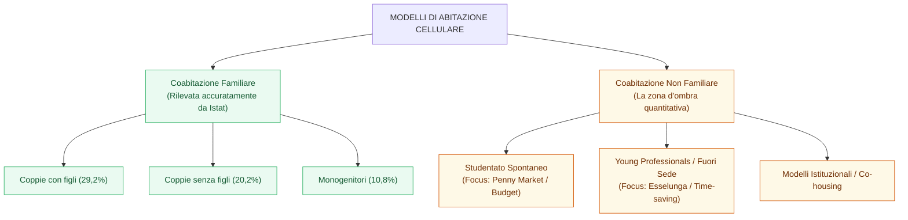
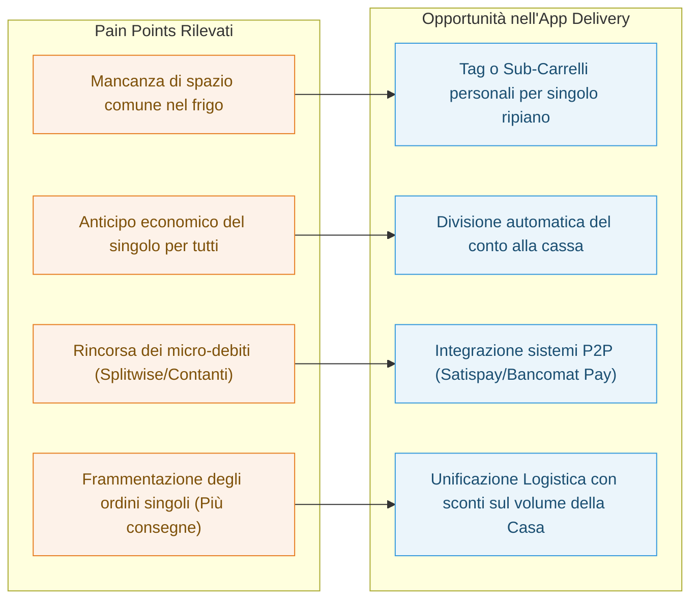

# Documentazione di Progetto: Delivery GDO per Nuove Forme dell'Abitare
**Progetto:** Ottimizzazione dei servizi di e-grocery (Esselunga / Penny Market) per nuclei di coabitazione non familiare.
**Metodologia:** Strategic UX Research & Service Design.

---

# PART 1: Ecosystem Map & Validazione dei Dati

##  Verifica della Tesi alla luce delle evidenze incrociate

**Tesi Iniziale:** 
*La casa non è più progettata soltanto per una famiglia, ma per una pluralità di persone e relazioni temporanee. Le app di spesa online della GDO (es. Esselunga, Penny) ignorano questo segmento collettivo, trattandolo erroneamente tramite account singoli.*

###  Il Fact-Checking Metodologico: Cosa è vero e cosa no?

1. **L'invisibilità anagrafica vs La realtà dei fatti:** L'intuizione di partenza è **parzialmente smentita** dal solo dato demografico Istat sulle famiglie, dove le coabitazioni non parentali faticano a emergere in modo pulito nella voce "Altra tipologia", ferma al 3,6%.
2. **La prova regina (I dati OMI):** La tesi viene **pienamente confermata** quando si incrocia la demografia con la contabilità dei contratti reali dell'Agenzia delle Entrate (OMI). La serie storica sul numero di contratti per **"Immobili in porzione"** (affitto di singole stanze) mostra un balzo netto da 265.277 a **349.028 contratti registrati**, certificando che circa il 35% delle locazioni urbane attive nei capoluoghi è ormai a stanze.
3. **Il Verdetto per il Design:** Il fenomeno non è una nicchia transitoria di studenti, ma un'infrastruttura macroeconomica consolidata. Oltre 1,5 milioni di individui in Italia coabitano legalmente condividendo la logistica dello stesso frigorifero, ma rimangono "nascosti" all'anagrafe come nuclei unipersonali separati. C'è un gap evidente tra il modello operativo della GDO e l'infrastruttura abitativa reale.

---

##  Ecosystem Map Strutturata

---

##  Tassonomia delle Forme di Coabitazione

---

##  Il Modello delle Frizioni e Mappatura delle Soluzioni

---

# PART 2:  UX Research Plan

## 1. Background & Context
Le attuali piattaforme di e-grocery e delivery dei grandi player della GDO (es. Esselunga, Penny Market) sono storicamente progettate su modelli familiari tradizionali o sul profilo del consumatore singolo. 

I dati demografici correnti evidenziano tuttavia una trasformazione strutturale della società: il crollo dei nuclei familiari con figli e la crescita esponenziale di famiglie unipersonali. Parallelamente, i dati OMI dell'Agenzia delle Entrate certificano l'esplosione dei contratti per "immobili in porzione" (stanze singole), passati a quota 349.028 unità attive.

Esiste un segmento di mercato emergente — composto da coinquilini non parenti — le cui dinamiche di economia domestica, logistica e condivisione delle spese alimentari non sono attualmente intercettate dall'offerta digitale della GDO.

## 2. Business Objectives & Design Opportunity
* **Dimostrare l'esistenza e il valore** di un cluster di utenti "collettivo" (il nucleo di coabitazione) attualmente ignorato dai sistemi di carrello e pagamento unici.
* **Identificare nuove feature di servizio** (es. carrelli condivisi, split-payment nativo, gestione delle macro-scorte comuni) in grado di posizionare il brand come abilitatore di nuove forme di convivenza, aumentando la fidelizzazione e lo scontrino medio della casa.

## 3. Research Goals (Obiettivi di Ricerca)
* **Goal 1:** Comprendere i modelli mentali e le dinamiche di collaborazione/frizione tra coinquilini nella gestione della spesa e della dispensa.
* **Goal 2:** Mappare l'attuale ecosistema di strumenti "accrocchiati" dagli utenti (es. WhatsApp + Splitwise + Excel) per compensare i limiti delle attuali app di delivery.
* **Goal 3:** Isolare i comportamenti d'acquisto comunitari (beni condivisi) da quelli individuali (spesa personale) all'interno dello stesso nucleo abitativo.
* **Goal 4:** Indagare la percezione e il posizionamento dei brand GDO (Premium vs Discount) all'interno delle economie di coabitazione.

## 4. Key Research Questions (Domande di Ricerca)
* *In che modo i coinquilini negoziano la lista della spesa comune e bilanciano le preferenze alimentari individuali?*
* *Quali sono i punti di attrito principali nella catena logistica della spesa in casa (dall'ordine, al momento del pagamento, fino allo stoccaggio in frigo)?*
* *Come viene vissuto l'impatto economico della spesa e come vengono gestiti i micro-debiti interni?*

## 5. Methodology & Research Tools
Per rispondere agli obiettivi utilizzeremo un approccio qualitativo ed esplorativo, ideale per mappare comportamenti complessi:

* **Interviste Qualitative Semi-strutturate (In-depth Interviews):** Interviste di 60 minuti condotte a coppie di coinquilini appartenenti allo stesso nucleo. Il focus sarà il racconto di episodi reali e la ricostruzione dell'ultima spesa effettuata.
* **Osservazione Contestuale / Contextual Inquiry (Disamina della Dispensa):** Durante le interviste, chiederemo ai partecipanti di mostrarci (anche via webcam o foto) l'organizzazione fisica del frigorifero e della dispensa, per validare sul campo le regole invisibili di gestione degli spazi condivisi.

## 6. Target & Sampling Plan (Criteri di Reclutamento)
Il campione complessivo sarà di **12-15 partecipanti** (suddivisi in circa 6-7 nuclei abitativi), profilati secondo i seguenti cluster estratti dall'Ecosystem Map:

* **Cluster 1: Lo "Studentato" spontaneo (3-4 coinquilini, focus budget):** Alta transitorietà, spesa frammentata, uso intensivo di digital tools per lo split dei costi. Target affine a Penny Market.
* **Cluster 2: Young Professionals in Co-housing (2-3 lavoratori fuori sede, focus time-saving):** Maggiore potere d'acquisto, alta penetrazione dei servizi di delivery, l'app serve a ottimizzare i tempi. Target affine a Esselunga.
* **Cluster 3: Il Lead Buyer (Profilo trasversale):** L'inquilino che storicamente si fa carico dell'ordine logistico per tutti e che sperimenta la massima frizione nel "rincorrere" gli altri per i rimborsi.

## 7. Expected Outputs (I Deliverable della Ricerca)
I dati qualitativi raccolti verranno sintetizzati e modellati nei seguenti artifact di design:
