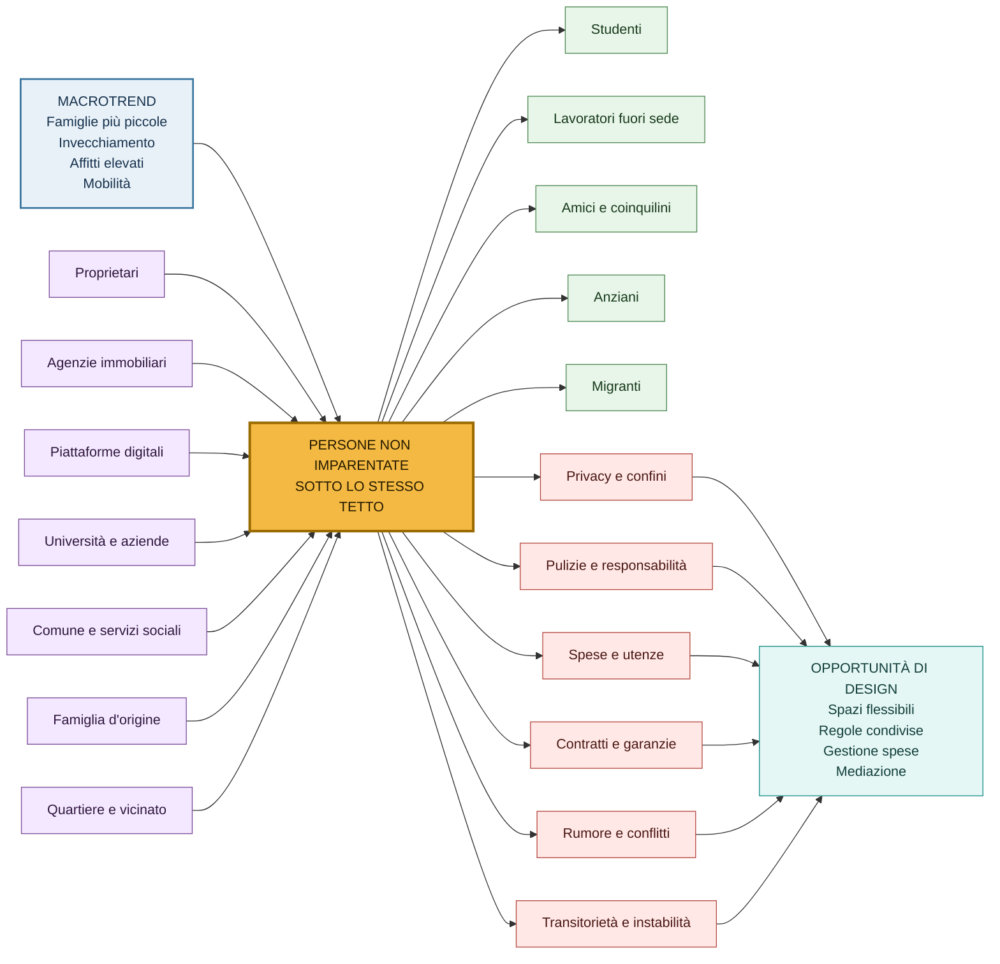
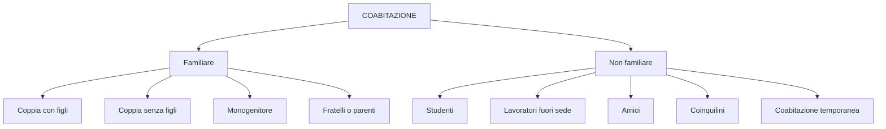
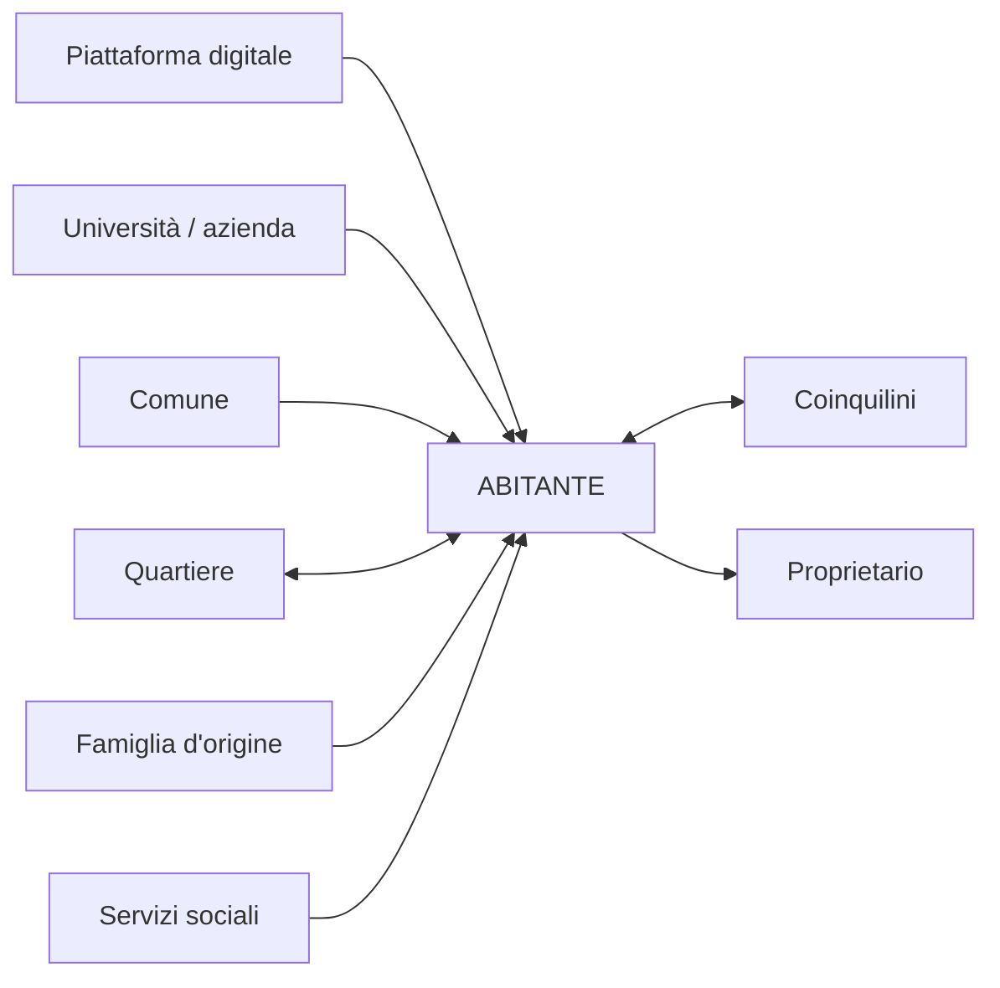
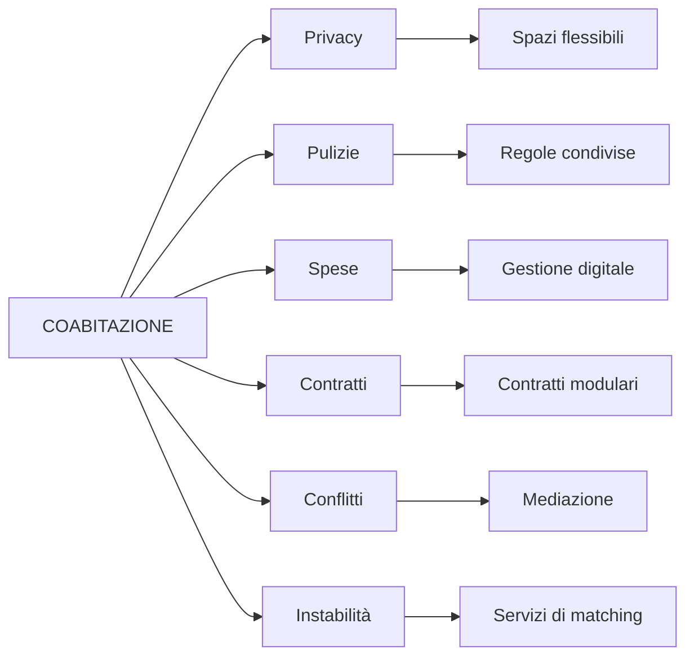

# Ecosystem map — Coabitazione e nuove forme dell’abitare

## Tesi

> La casa non è più progettata soltanto per una famiglia, ma per una pluralità di persone e relazioni temporanee.

I dati Istat mostrano famiglie più piccole, più persone sole e una riduzione delle coppie con figli. La coabitazione tra persone non imparentate va letta dentro questo cambiamento, anche se le statistiche ufficiali non isolano sempre i coinquilini non parenti. [web:18][web:19]

## Evidenze quantitative

| Indicatore | 2002-2003 | 2023-2024 | Evoluzione |
|---|---:|---:|---|
| Famiglie unipersonali | 25,5% | 36,2% | Forte aumento |
| Coppie con figli | 42,2% | 29,2% | Forte diminuzione |
| Coppie senza figli | 20,9% | 20,2% | Quasi stabile |
| Famiglie monogenitore | 8,2% | 10,8% | Aumento |
| Altra tipologia* | 3,2% | 3,6% | Lieve aumento |

\* “Altra tipologia” comprende famiglie senza nucleo diverse dalle persone sole e famiglie formate da due o più nuclei; non coincide esclusivamente con i coinquilini non parenti. [web:19]

La dimensione media della famiglia è scesa da circa 2,6 a circa 2,2 persone. [web:18][web:19]

## Ecosystem map

## Forme di coabitazione

## Attori e relazioni

## Problemi e opportunità

## Nota metodologica

I dati Istat descrivono la struttura delle famiglie, non tutti i casi di semplice condivisione dell’abitazione. “Altra tipologia” può comprendere due fratelli conviventi, ma non identifica separatamente tutti i coinquilini non parenti. Per documentare il fenomeno specifico servono anche interviste, osservazione e dati su studenti, lavoratori mobili, migranti e abitazioni condivise. [web:18][web:19]

## Riferimenti

- Istat, [Indicatori demografici — Anno 2024](https://www.istat.it/comunicato-stampa/indicatori-demografici-anno-2024/). [web:18]
- Istat, [Indicatori demografici — Anno 2024, PDF](https://www.istat.it/wp-content/uploads/2025/03/indicatori_demografici_2024.pdf). [web:19]
- Istat, [I nuclei familiari nei censimenti della popolazione](https://www.istat.it/comunicato-stampa/i-nuclei-familiari-nei-censimenti-della-popolazione/). [web:17]
- Istat, [Previsioni della popolazione e delle famiglie](https://www.istat.it/wp-content/uploads/2024/07/Previsioni-popolazione-famiglie_2023.pdf). [web:25]
- Visual Studio Code, [Markdown](https://code.visualstudio.com/docs/languages/markdown). Supporto ai blocchi Mermaid nella preview. [web:27]
- Mermaid, [Flowcharts](https://mermaid.ai/open-source/syntax/flowchart.html). Sintassi per diagrammi. [web:28]
